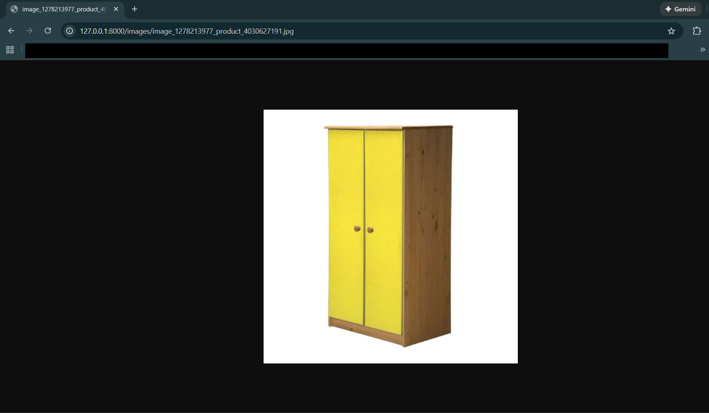
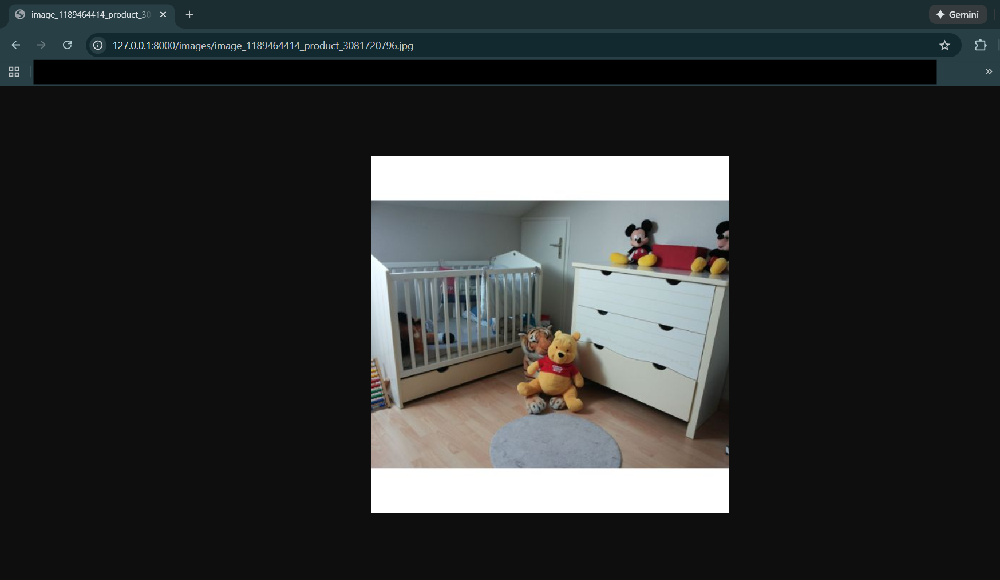
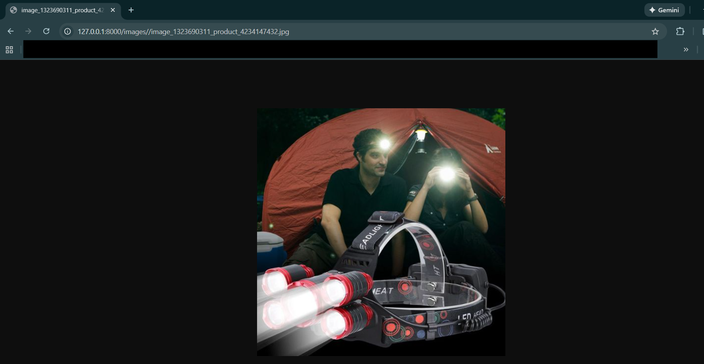

# Nano Multimodal Data Curation & Retrieval Pipeline

## Overview

This project implements an end-to-end **multimodal data curation and retrieval platform** designed to mirror the workflows used in large-scale visual–language model training and data distillation systems.

---

## Key Pipeline Stages

**1) Raw Dataset Ingestion**  
Image–text product data (titles, descriptions, and labels) are sourced from a large open e-commerce dataset.

**2) Sampling**  
A controlled subset is selected to support experimentation under constrained GPU resources while preserving dataset diversity.

**3) Image Collection**  
All referenced images are gathered locally and aligned with metadata records for consistent multimodal processing.

**4) Cleaning**  
Invalid samples are removed (missing images or corrupted text) to ensure reliable training and evaluation input.

**5) CLIP Batch Embedding**  
All images and text are batch-encoded using a pre-trained CLIP model to generate normalized visual and textual embeddings.

**6) Alignment + Deduplication Curation**  
- **Cross-modal alignment scoring** filters weak image–text pairs.
- **Embedding-space deduplication** removes visually and semantically redundant samples.
  
This stage acts as the platform’s **data distillation core**, reducing training noise while preserving diversity and information density.

**7) Downstream Evaluation**  
A supervised product-category classifier trains on both raw and curated datasets to quantify performance differences, demonstrating how distilled data improves or preserves accuracy with fewer samples.

**8) Semantic Retrieval API**  
A production-style FastAPI service delivers real-time multimodal retrieval and dataset inspection capabilities over the curated corpus.

---

## Capabilities

- **Large-scale batch inference pipelines** using CLIP for image-text representation learning.
- **Data distillation & quality optimization**, filtering noisy pairs and removing duplicates to improve training efficiency.
- **Exploration of multimodal SOTA models** for cross-modal alignment and retrieval.
- **End-to-end multimodal systems design**, from ingestion and processing to evaluation and serving.
---

## API (Deliver Layer)

The final API layer provides a clean, queryable interface over the curated multimodal dataset.

### Start the Server

```bash
uvicorn src.07_api_server:app --reload
```

## Dataset

Kaggle Multimodal E-Commerce Dataset (https://www.kaggle.com/datasets/ziya07/multimodal-e-commerce-dataset/data)


## API Endpoints

### POST `/search`
Semantic retrieval – converts text queries into CLIP embeddings and returns the most relevant product images with metadata.

### GET `/record/{id}`
Record inspection – fetches one curated multimodal data point for auditing and debugging.

### GET `/stats`
Dataset monitoring – returns dataset size, class distribution, and alignment score statistics.


## API EXAMPLES
**The query needs to be in French because the Kaggle dataset is in French**

Example 1: Query for "armoire chambre enfants"
curl -X POST "http://127.0.0.1:8000/search" -H "Content-Type: application/json" -d "{\"query\":\"armoire chambre enfants\",\"top_k\":5}"

Translation:
armoire chambre enfants = children's bedroom wardrobe

Returned Image(s):




Example 2: Query for "lampe torche étanche camping"
curl -X POST "http://127.0.0.1:8000/search" -H "Content-Type: application/json" -d "{\"query\":\"lampe torche étanche camping\",\"top_k\":5}"

Translation:
lampe torche étanche camping = waterproof camping flashlight

Returned Image(s):



Sample Json Answer:
[
    {
        "image_url": "http://127.0.0.1:8000/images/{imageid}_{productid}.jpg",
        "score": {cosine similarity score bw query and image}
    }
]


# TODO

* Add endpoints to add new data
* Include more modalities


## Compute Resources
* GPU (NVIDIA RTX 4060, 8GB VRAM)
